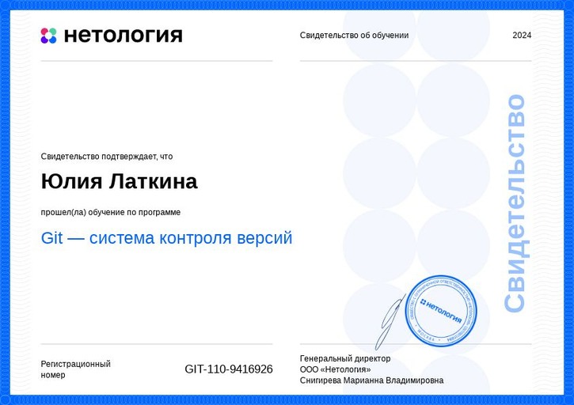
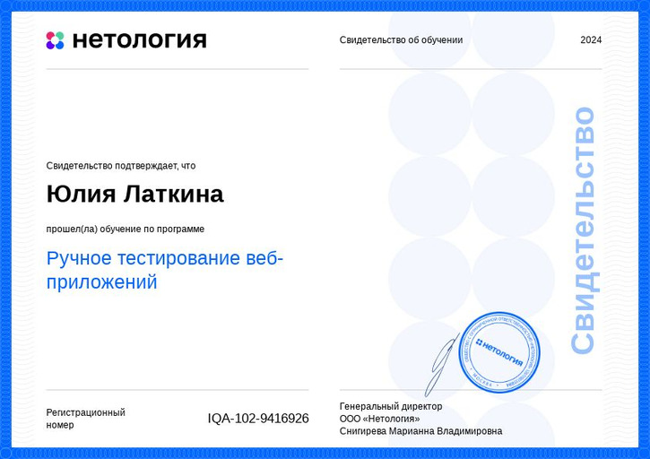

**ФИО:** Латкина Юлия Сергеевна

**Дата рождения:** 8 августа 1969 года

**Контакты:**

Телефон: +7 (917) 7790008

Email: latkina0808@yandex.ru

**Образование:**

Нетология.
Факультет: Тестирование ПО, 2024 – настоящее время.

Московский государственный технологический институт Уфимский филиал, 1986-1992

Факультет: Технология швейных изделий.

Квалификация: Инженер-технолог швейного производства

**Навыки:**

Основы тестирования ПО

Работа с баг-трекерами (Jira)

Знание методологий Agile и Scrum

Базовые знания SQL

Умение работать с документацией (требования, чек-листы, тест-кейсы)

Владение инструментами тестирования (Postman)

**Опыт работы:** 

2015-2024 МАОУ «Гимназия №16»
Учитель технологии

2009-2015 ИП Латкина Ю.С.
Текстильный дизайн

2001-2008   Магазин «Ветвяна»
Дизайнер текстильного интерьера, менеджер по продажам, зав. секцией

1992-2001   Средняя школа № 16.                               Преподаватель технологии.

1991-1992   Уфимский техникум легкой промышленности.
Секретарь на кафедре иностранных языков, секретарь руководителя.

**Личные качества:**

Внимательность к деталям

Аналитическое мышление

Способность быстро обучаться новым технологиям

Коммуникабельность и умение работать в команде

Отвественность

**Курсы и сертификаты:**

2023  ИНПО «Вектор развития» ФГООУВО «Башкирский государственный педагогический университет им. М.Акмуллы» по дополнительной профессиональной программе «Робототехника» 72 часа

2024  Образовательная платформа Нетология, Инженер по тестированию ПО (обучаюсь)

